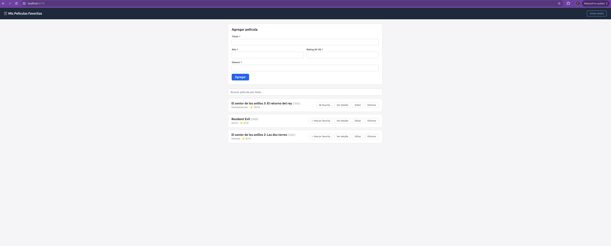
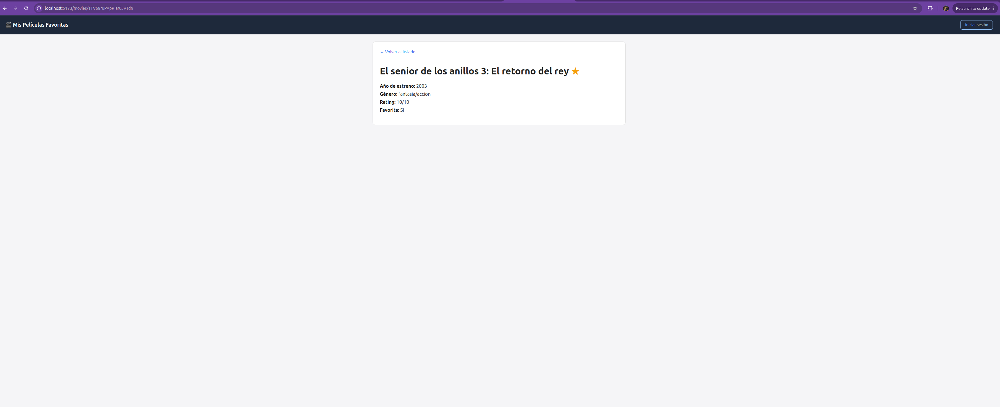
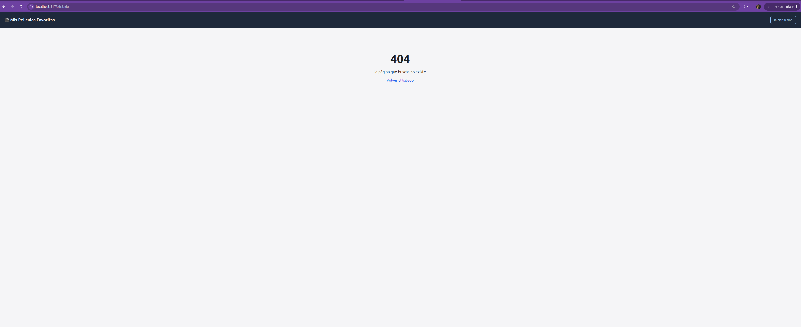

# peliculas-favoritas

# 🎬 Mis Películas Favoritas — CRUD con React, React Router y Firebase

**Curso:** Trabajo Final — Centro de e-Learning UTN BA  
**Módulo:** Aplicación CRUD con React, React Router y Firebase  
**Autor:** Facundo Rodriguez  
**Temática elegida:** Opción 1 — Mis películas favoritas

---

## 📸 Capturas de pantalla






---

## 📋 Descripción

Aplicación web para gestionar una colección personal de películas favoritas,
desarrollada con **React (Vite)**, **React Router** y **Firebase Firestore** como
trabajo final del curso. Permite visualizar, buscar, agregar, editar y eliminar
películas, además de marcarlas/desmarcarlas como favoritas y consultar el
detalle individual de cada una. Los datos se almacenan íntegramente en
Firestore (no se usa un array local ni `localStorage` como fuente de datos), y
toda la comunicación con la base de datos está aislada en un módulo de
servicios independiente de los componentes.

---

## 🚀 Cómo clonar e iniciar el proyecto

```bash
# 1. Clonar el repositorio
git clone https://github.com/FARO1993/peliculas-favoritas.git

# 2. Ingresar a la carpeta
cd peliculas-favoritas

# 3. Instalar dependencias
npm install

# 4. Configurar las variables de entorno
cp .env.example .env
# completar .env con los datos de tu proyecto de Firebase

# 5. Iniciar el servidor de desarrollo
npm run dev
```

Abrí el navegador en `http://localhost:5173` (o el puerto que indique Vite en la terminal).

### Configuración de Firebase

1. Crear un proyecto en [Firebase Console](https://console.firebase.google.com/).
2. Habilitar **Firestore Database** (modo de prueba o con reglas propias).
3. Crear una colección llamada `peliculas` (se crea sola al agregar la primera película desde la app).
4. Copiar las credenciales del proyecto (Configuración del proyecto → General → tus apps → SDK config) al archivo `.env`, usando `.env.example` como referencia.

---

## 📁 Estructura del proyecto

```
peliculas-favoritas/
├── .env.example
├── index.html
├── package.json
├── vite.config.js
└── src/
    ├── main.jsx
    ├── App.jsx
    ├── index.css
    ├── config/
    │   └── firebase.js          ← inicialización de Firebase con variables de entorno
    ├── services/
    │   └── peliculasService.js  ← obtenerTodos, obtenerPorId, crear, actualizar, eliminar, cambiarEstado
    ├── validators/
    │   └── peliculaValidator.js ← validación de campos obligatorios, separada del formulario
    ├── router/
    │   └── AppRouter.jsx        ← BrowserRouter con todas las rutas de la app
    ├── context/
    │   └── AuthContext.jsx      ← estado simple de "usuario logueado"
    ├── components/
    │   ├── Layout.jsx           ← navegación fija + <Outlet />
    │   ├── Navbar.jsx
    │   ├── Buscador.jsx
    │   ├── PeliculaCard.jsx
    │   └── PeliculaForm.jsx     ← formulario controlado (alta y edición)
    ├── views/
    │   ├── ListadoPeliculas.jsx ← vista principal: listado, búsqueda y CRUD
    │   ├── DetallePelicula.jsx  ← ruta dinámica /movies/:id
    │   ├── Login.jsx
    │   └── NotFound.jsx         ← página 404
    └── styles/
        ├── App.css
        └── Navbar.css
```

---

## 🧩 Requisitos técnicos y cómo se resolvieron

| Requisito | Implementación |
|---|---|
| `useState` | Estados de formulario, listado, búsqueda, carga y errores |
| `useEffect` | Carga inicial de películas y del detalle según el `id` de la URL |
| `useMemo` | Filtrado optimizado de películas por título en `ListadoPeliculas.jsx` |
| `useRef` | Foco automático en el campo "Título" al abrir el formulario (`PeliculaForm.jsx`) |
| React Router | Rutas: `/` (listado), `/login`, `/movies/:id` (detalle, dinámica), `*` (404) |
| Firebase Firestore | CRUD completo sobre la colección `peliculas` |
| Servicios | `peliculasService.js` concentra toda la lógica de Firestore, fuera de los componentes |
| Variables de entorno | Configuración de Firebase en `.env` (ver `.env.example`), nunca hardcodeada |
| Formulario controlado | `PeliculaForm.jsx`, con limpieza de campos tras guardar y validación previa |
| Validación | `peliculaValidator.js`, módulo independiente del formulario |
| Búsqueda y filtrado | Campo de búsqueda + `useMemo` en `ListadoPeliculas.jsx` |
| Edición | Botón "Editar" precarga el formulario y actualiza en Firestore al guardar |
| Eliminación | Confirmación previa (`window.confirm`) antes de eliminar de Firestore |
| Estado adicional | Marcar/desmarcar como favorita (`cambiarEstado()`) |
| Estados de carga/error | Mensajes de "Cargando...", errores de red y feedback en cada operación |

---

## 📚 Bibliografía y créditos

**Referencias:**
- Banks, A. y Porcello, E. *Learning React: Modern Patterns for Developing React Apps*. 2ª ed. O'Reilly Media, 2020.
- React. *Reusing Logic with Custom Hooks*. https://react.dev/learn/reusing-logic-with-custom-hooks
- React Router. *Tutorial*. https://reactrouter.com/en/main/start/tutorial
- Firebase. *Cloud Firestore Documentation*. https://firebase.google.com/docs/firestore
- Vite. *Env Variables and Modes*. https://vite.dev/guide/env-and-mode
- Anthropic. Claude (modelo de inteligencia artificial). Utilizado como asistente para la generación y revisión del código de este proyecto. https://www.anthropic.com
